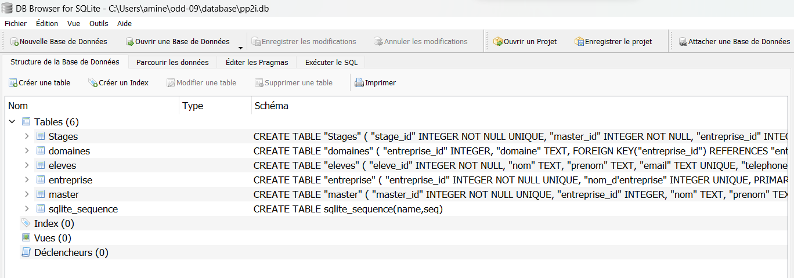

## The Database File :
The databse file is written with sqlite3 and is complient with the UML model (uml.svg)
it contains the 5 tables from the UML with subtle differences

To have a major look at it you can use DB Browser (or database viewer in vsc) like seen in the exemple below :

# db browser is availible to install with apt on linux or simple install from windows

## Templates File:
stages2.html and recherche2.html  are  modified versions of stages.html ans recherche2.html respectively.

## Demonstration with 1A / 2A / 3A Filter

launch the flask_app.py file 
open your internet browser and connect to your localhost at the correct {port} (found in the python terminal)
url will be something like http://localhost:{port}/recherche

once on the website you can write in uppercase in the category input "1A" "2A" or "3A"

there is a google talents integration that is light it just copies the url and injects it into the jobs part of google 
it's something small but better than nothing (i do think it works better than i intended it to be XD)
soo yeah we can say google button works
